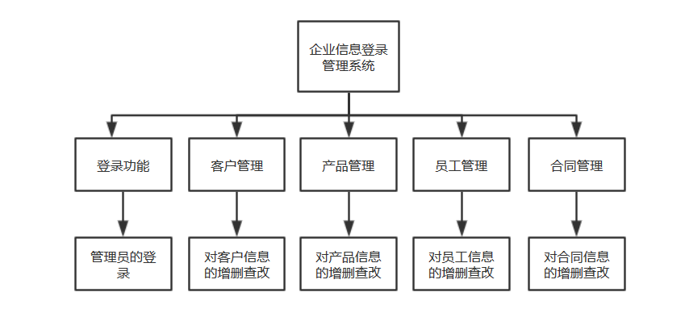
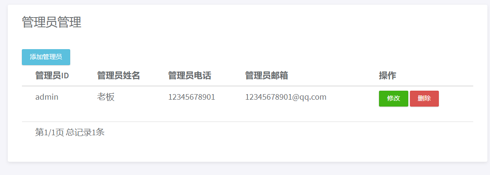
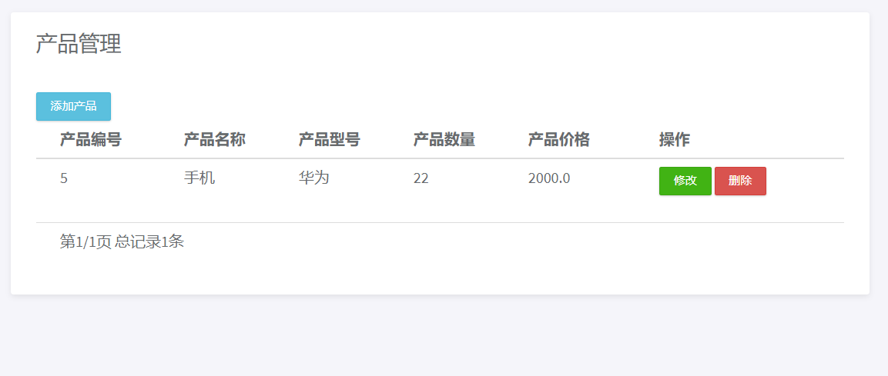
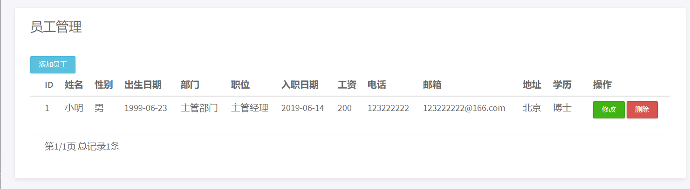
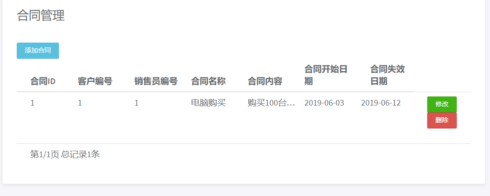

## 企业信息登录管理系统

主要流程图如下



系统信息保存使用Mysql的J2EEDB数据库

### 登录功能

所有级别管理员都使用同一登录页面进行登录

登录后进入主页面，主页面包含其他功能的超链接

管理员SQL：

```sql
CREATE TABLE Manager(
	managerId 	 	CHAR(10) 		UNIQUE 	NOT NULL, -- 管理员ID
	manPassword  	CHAR(10) 			NOT NULL, -- 管理员密码
	manName			 	VARCHAR(20)		NOT NULL, -- 管理员姓名
	manTelephone 	VARCHAR(20), -- 管理员电话
	manEmail			VARCHAR(20), -- 管理员邮箱
	manPer        INT            	NOT NULL, -- 管理员权限   
	CONSTRAINT ManagerPK PRIMARY KEY (managerId)
)
```

关于管理员权限：有三个等级1,2

等级1 ：可以操作除添加管理员所有功能

等级2 ：可以操作所有功能

### 管理员管理

最高级别的管理员对等级1管理员的信息改动



### 客户管理

用户信息SQL：

```sql
USE j2eedb;
CREATE TABLE Client(
	clientId 	 		CHAR(10) 		UNIQUE 	NOT NULL, -- 客户ID
	cliName			 	VARCHAR(20)				NOT NULL, -- 客户姓名
	cliTelephone 	VARCHAR(20), -- 客户电话
	cliEmail			VARCHAR(20), -- 客户邮箱
	cliAddress		VARCHAR(40), -- 客户地址
	CONSTRAINT ClientrPK PRIMARY KEY (clientId)
)
```


### 产品管理

产品信息SQL：

```sql
USE j2eedb;
CREATE TABLE Product(
	productId 			CHAR(15) 	UNIQUE 	NOT NULL, -- 产品ID
	productModel		CHAR(10), -- 产品型号
	productNum			NUMERIC, -- 产品数量
	productPrice		NUMERIC, -- 产品价格
	CONSTRAINT ProductPK PRIMARY KEY (productId)
)
```



### 员工管理

员工信息SQL：

```sql
USE j2eedb;
CREATE TABLE Employee(
	employeeId 	 	CHAR(10) 		UNIQUE 	NOT NULL, -- 员工ID
	empName			 	VARCHAR(20)			NOT NULL, -- 员工姓名
	empSex			CHAR(2), -- 员工性别
	empBirthday		date, -- 员工出生日期
	empDepartment	VARCHAR(30), -- 员工部门
	empTitle		VARCHAR(20), -- 员工职位
	empHireDate		date, -- 员工入职日期
	empSalary		NUMERIC, -- 员工工资
	empTelephone 	VARCHAR(20), -- 员工电话
	empEmail		VARCHAR(20), -- 员工邮箱
	empAddress		VARCHAR(40), -- 员工地址
	empEducation	VARCHAR(20), -- 员工学历
	CONSTRAINT EmployeePK PRIMARY KEY (employeeId)
)
```



### 合同管理

合同信息SQL：

```sql
USE j2eedb;
CREATE TABLE Contract(
	contractId 	INT AUTO_INCREMENT UNIQUE NOT NULL, 
    -- 合同编号，自增，不用人为添加
	clientNo				CHAR(10) 	 NOT NULL, -- 客户编号
    employeeId              char(10)     NOT NULL, -- 员工编号
	contractName			VARCHAR(20)			NOT NULL,-- 合同名称
	contractContent 		TEXT,-- 合同内容
	contractStartTime		VARCHAR(20),-- 生效日期
	contractValidity		VARCHAR(40),-- 有效日期
	CONSTRAINT ContractPK PRIMARY KEY (contractId)
)
```

关于此信息员工编号，只有客户员编号才有效，其他如：程序员等是无效的



### 注：

由于此项目是小型开发，取消所有外键关联。

